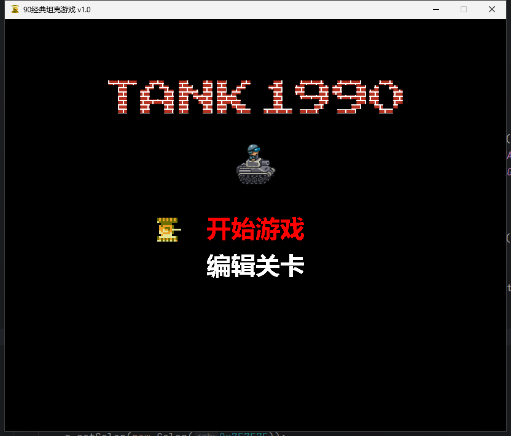
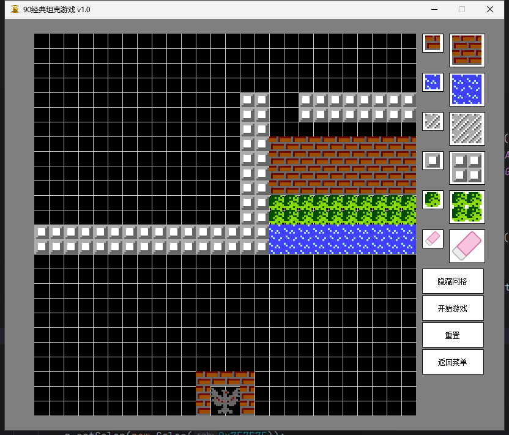

# 简介

> 基于Java Swing实现的90坦克大战经典

# 操作指南

## 欢迎界面

- W: 向上切换菜单
- S: 向下切换菜单
- ENTER: 进入菜单

## 关卡界面

## 玩家1
- W: 向上运动
- S: 向下运动
- D: 向右运动
- A: 向左运动
- SPACE: 发射子弹
## 玩家2
- up: 向上运动
- down: 向下运动
- left: 向右运动
- right: 向左运动
- 9: 发射子弹

# 游戏界面

## jar包打包
idea通过 Project Structure 选择 Artifacts 添加选择来自模块依赖项目，选择第一个
将依赖jar包也同时导入项目中完成后，在菜单栏中选择build Artifacts即可生成

## jar包启动命令
java -cp tank_90.jar cn.play.freely.game.tank.main.Main

